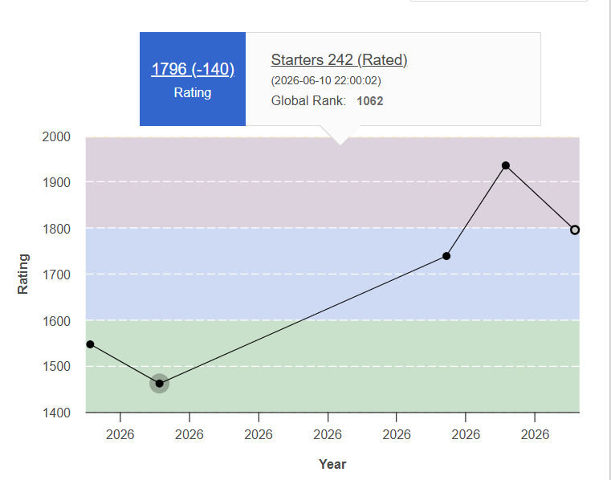

# 💫 About Me

Final-year Computer Engineering student passionate about **DevOps, Cloud Computing, and Open Source**. I enjoy building scalable, reliable, and automated systems while exploring modern infrastructure and deployment practices.

Currently focused on mastering **Docker, Kubernetes, Terraform, Jenkins, CI/CD pipelines, Linux, and Cloud Technologies**, with a strong interest in infrastructure automation and platform engineering.

I actively seek opportunities to contribute to **Open Source Projects**, collaborate with developers worldwide, and learn from real-world engineering challenges.

My technical foundation includes **Data Structures & Algorithms, Operating Systems, DBMS, Computer Networks, and Full-Stack Development**, enabling me to approach problems from both software and infrastructure perspectives.

Driven by curiosity and continuous learning, I am always excited to work on impactful projects, embrace new technologies, and build production-ready solutions.

---

# 🌐 Connect With Me

---

# ⚙️ DevOps & Technologies

  

---

# 💻 Coding Profiles

  

 

  

<h3 align="center">
⭐ CodeChef Rating: 1796 (3★)
</h3>

  🌍 Global Rank: <b>1062</b>

  

---

# 🌟 Portfolio & Achievements

  

  

 

<table align="center">
<tr>
<td align="center" width="50%">

### 🌐 Portfolio

Explore my projects, technical skills, internships, hackathons, and development journey.

</td>

<td align="center" width="50%">

### 🏆 Certifications & Achievements

Courses, certifications, hackathons, coding achievements, workshops, and technical accomplishments.

</td>
</tr>
</table>

  <i>Building AI-powered solutions, full-stack applications, and innovative projects while continuously learning and contributing to the tech community.</i>

---

# 🌱 Currently Learning

* Kubernetes & Helm
* Advanced Terraform
* GitOps with ArgoCD
* AWS Cloud Services
* Open Source Contribution Workflow
* CI/CD Best Practices

---

# 🌟 Featured Projects

### 🔹 Placement Portal

Campus recruitment platform with role-based access and streamlined hiring workflow.

### 🔹 MediWise

AI-assisted prescription analysis and medicine recommendation platform.

### 🔹 DevOps Projects

Dockerized applications, CI/CD pipelines, Infrastructure as Code with Terraform, Jenkins automation, and cloud deployments.

### 🔹 Open Source Contributions

Actively contributing to DevOps and cloud-native projects.

---

# 📈 GitHub Activity

---

# 📚 Most Used Languages

  

---

